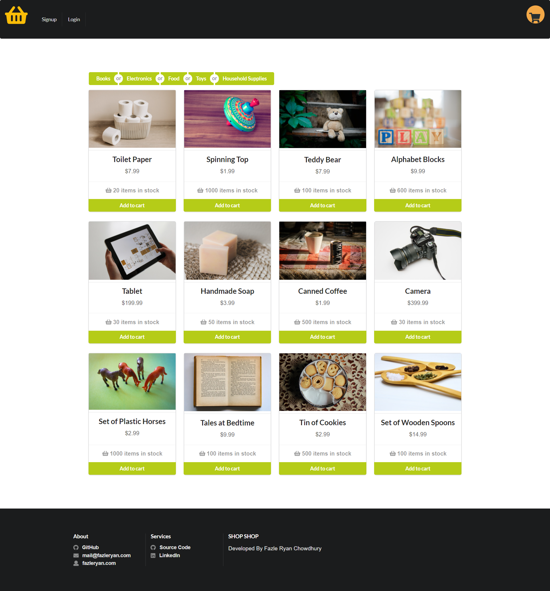

# shop-shop

## Screenshot:

## USAGE:
- With shop-shop, anyone will be able to choose items, register account and then pay through stripe platform

## DESCRIPTION:
- This is an e-commerce platform that uses Redux to manage global state
- User can create account or login into the site
- User can filter products by categories
- User can add items from home page or from product details page
- User can add item and quantity and remove item from product details page
- User can update quantity or remove item from the cart
- User can see the product in the cart while revisiting (data stored through indexedDB)
- User will be able to browse website with no internet after initial loading. (PWA)
- User can checkout through stripe gateway
- Order history will be visible to user from Order History tab.

## Technologies used:
- Client Side: React, Redux, apollo/react-hooks, apollo-boost, graphql
- Backend: apollo-server-express, express, graphql, jsonwebtoken, mongoose, stripe

## Site:
- Link to the site: https://ryan7998.github.io/react-portfolio/